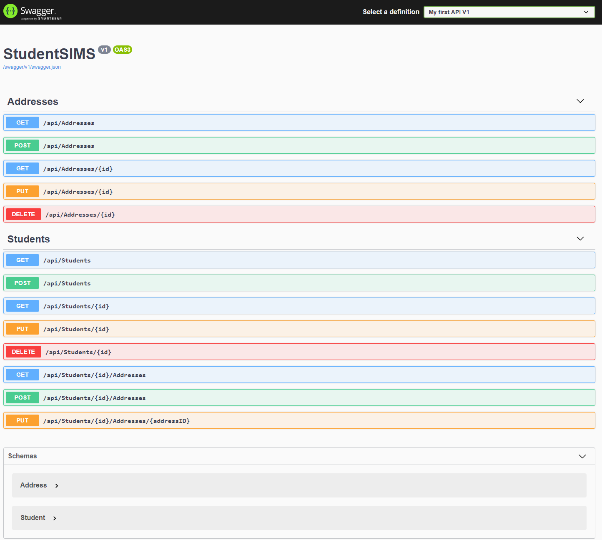

# StudentSIMS-backend

[Hosted on Azure](http://studentsims.azurewebsites.net/index.html)

This project is an assignment for Microsoft Student Accelerator NZ 2020 Phase 1.
Back End Development - Database and API.

[Microsoft Student Accelerator](http://aka.ms/nzmsawebsite)
[2020-Phase-1](https://github.com/NZMSA/2020-Phase-1)

#### Project Guidelines

- Create a **code-first** API server with Azure SQL Database
  - Database:
    - Create another table named **Address** with attributes: `StudentId`, `Street Number`, `Street`, `Suburb`, `City`, `Postcode` and `Country`. The **Student** table would have a one-to-many relationship with this table. Please assign appropriate datatype (i.e. `string`, `int` etc.) for each of the attributes.
    - Show SQL database through the Query editor (**screenshots**) for both tables with rows of example instances

  - API manipulate the created Azure Database using Code-First migration:
    - Create basic CRUD requests for the **Student** and **Address** table.
    - Create an API method that **adds** new address for a student using his/her StudentId.
    - Create an API method that **changes** the address of a student using his/her StudentId.
    - **Screenshot** of Swagger UI showing all API Endpoints

## Database

#### Student Table: 

Added Sample data to Student Table

#### Address Table:

Created Address Table with fields and foreign key to Student Table

## API

#### Swagger:

CRUD requests created for `api/Addresses` and `api/Students` - Auto generated.

Created GET method for getting all addresses related to a student GET `api/Students/{id}/Addressses`

Created POST method for adding new address for a student POST `api/Students/{id}/Address`

Created PUT method for changing the address of a student PUT `api/Students/{id}/Address/{addressID}`

I have chosen to places these methods part of `api/Students` as these calls all require `studentID` and are all related to one student.

`api/Students/{id}/Address/{addressID}` requires `addressID` to identify which address to change. This is because each student can have multiple addresses (one-to-many relationship).